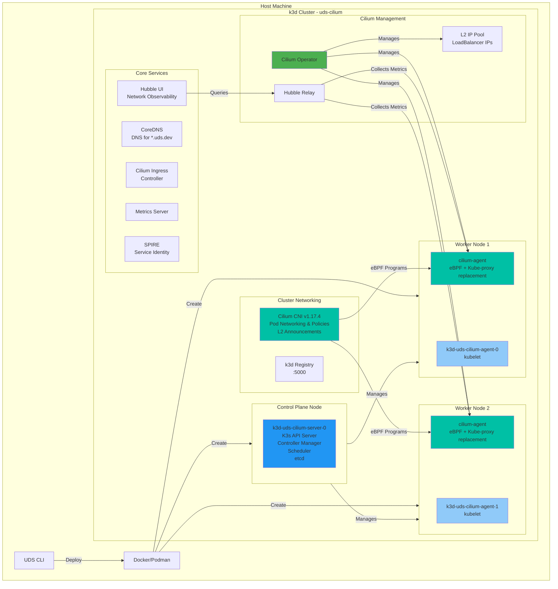

# UDS k3d Cilium Zarf Package

> [!IMPORTANT]
> This package should only be used for development and testing purposes. It is not intended for production use and all data is overwritten when the package is re-deployed.

This zarf package serves as a base for standing up a multi-mode Kubernetes cluster running Cilium in kube-proxy replacement mode.

- [UDS k3d Cilium Zarf Package](#uds-k3d-cilium-zarf-package)
  - [Overview](#overview)
  - [Prerequisites](#prerequisites)
    - [System Requirements](#system-requirements)
  - [Architecture](#architecture)
  - [Configuration](#configuration)
    - [Variables](#variables)
    - [Components](#components)
  - [Build and Deploy](#build-and-deploy)
    - [Deploy](#deploy)
    - [Deploy with Custom Settings](#deploy-with-custom-settings)
    - [Docker Hub Authentication (Optional)](#docker-hub-authentication-optional)
    - [Airgap Deployment](#airgap-deployment)
    - [DNS Configuration](#dns-configuration)
  - [Cluster Management](#cluster-management)
    - [Stop and Start](#stop-and-start)
    - [Remove](#remove)
    - [Remote Access](#remote-access)
  - [Verification](#verification)
    - [Check Cilium Installation](#check-cilium-installation)
    - [Run Validation Tests](#run-validation-tests)
  - [Troubleshooting](#troubleshooting)
    - [Network Connectivity](#network-connectivity)
  - [Advanced Configuration](#advanced-configuration)
    - [Custom k3d Arguments](#custom-k3d-arguments)
  - [Additional Documentation](#additional-documentation)
  - [UDS Core Integration](#uds-core-integration)
    - [Istio CNI Compatibility](#istio-cni-compatibility)
    - [Bundle Configuration](#bundle-configuration)
  - [Notes](#notes)
  - [Resources](#resources)

## Overview

The UDS k3d Cilium package creates a k3d cluster with the following features:

- **k3d cluster** with configurable nodes (default: 1 server, 2 workers)
- **Cilium CNI v1.17.4** with eBPF for high-performance networking and security
- **Kube-proxy replacement** mode for optimal performance
- **Cilium L2 Announcements** for LoadBalancer services (replaces MetalLB)
- **Hubble observability** with UI and relay for network visibility
- **WireGuard encryption** for secure node-to-node communication
- **SPIRE integration** for mutual TLS authentication
- **Cilium Ingress Controller** as the default ingress solution
- **Integration with UDS Core** including Istio service mesh support
- **Istio CNI compatibility** with CNI chaining enabled for ambient mesh
- **DNS resolution** for `*.uds.dev` domains via CoreDNS overrides
- **Configurable network CIDRs** for subnet, pod, and service networks

## Prerequisites

- [Docker](https://docs.docker.com/get-docker/) or [Podman](https://podman.io/getting-started/installation) for running k3d

### Required CLI Tools

The following tools are required and can be installed individually or via the provided OCI artifact:
- [UDS CLI](https://uds.defenseunicorns.com/reference/cli/quickstart-and-usage/#install): version 0.20.0 or later
- [k3d](https://k3d.io/#installation): version 5.7.1 or later
- [Cilium CLI](https://docs.cilium.io/en/stable/gettingstarted/k8s-install-default/#install-cilium-cli): version 0.16.0 or later

**Quick Install via OCI Artifact:**
```bash
# Install all required tools at once (auto-detects OS and architecture)
curl -sL https://raw.githubusercontent.com/mkm29/uds-k3d-cilium/main/tools/install.sh | bash

# Or specify a custom install path
curl -sL https://raw.githubusercontent.com/mkm29/uds-k3d-cilium/main/tools/install.sh | INSTALL_PATH=/usr/local/bin bash
```

### System Requirements

- **Memory**: 16GB RAM recommended
- **CPU**: 4+ cores recommended
- **Disk**: 10GB+ available space

## Architecture



For detailed architecture diagrams and component descriptions, see:
- [Cilium CNI Documentation](docs/CILIUM.md) - Complete Cilium architecture and component details
- [eBPF Dataplane Documentation](docs/EBPF.md) - eBPF dataplane architecture and traffic flow

## Configuration

### Variables

The following variables can be configured when deploying the UDS k3d Cilium package:

| Name | Description | Type | Default | Required |
|------|-------------|------|---------|:--------:|
| `CLUSTER_NAME` | Name of the cluster | `string` | `"uds-cilium"` | no |
| `SUBNET_CIDR` | Subnet CIDR for the cluster | `string` | `"10.0.0.0/16"` | no |
| `POD_CIDR` | Pod CIDR for the cluster | `string` | `"10.1.0.0/16"` | no |
| `SERVICE_CIDR` | Service CIDR for the cluster | `string` | `"10.96.0.0/12"` | no |
| `K3D_IMAGE` | k3d image to use | `string` | `"rancher/k3s:v1.32.5-k3s1"` | no |
| `K3D_EXTRA_ARGS` | Optionally pass k3d arguments to the default | `string` | `""` | no |
| `NGINX_EXTRA_PORTS` | Optionally allow more ports through Nginx (combine with K3D_EXTRA_ARGS '-p &lt;port&gt;:&lt;port&gt;@server:*') | `string` | `"[]"` | no |
| `DOMAIN` | Cluster domain | `string` | `"uds.dev"` | no |
| `ADMIN_DOMAIN` | Domain for admin services, defaults to `admin.DOMAIN` | `string` | `""` | no |
| `NUMBER_OF_SERVERS` | Number of server nodes | `string` | `"1"` | no |
| `NUMBER_OF_AGENTS` | Number of worker nodes | `string` | `"2"` | no |
| `EXTRA_TLS_SANS` | Additional TLS SANs for the cluster (comma-separated) | `string` | `"127.0.0.1"` | no |
| `DOCKER_HUB_USERNAME` | Username for Docker Hub authentication | `string` | `""` | no |
| `DOCKER_HUB_PASSWORD` | Password for Docker Hub authentication | `string` | `""` | no |
| `CILIUM_VERSION` | Version of Cilium to install | `string` | `"v1.17.4"` | no |
| `BASE_IP` | Base IP address for Cilium L2 IP pool (auto-detected) | `string` | `""` | no |

### Components

The following components are available in the UDS k3d Cilium package:

> [!NOTE]
> Cilium provides built-in L2 announcements for LoadBalancer services, replacing the need for MetalLB. The Cilium Ingress Controller is enabled by default.

> [!IMPORTANT]
> The package uses the Cilium CLI for installation rather than Helm, as `zarf tools helm` only includes repo and dependency management commands, not the full Helm CLI functionality. Ensure the Cilium CLI is installed before deployment.

| Name | Description | Required |
|------|-------------|:--------:|
| `destroy-cluster` | Optionally destroy the cluster before creating it | yes |
| `k3d-airgap-images` | Load the airgap images for k3d into Docker | yes¹ |
| `create-cluster-airgap` | Required component for airgap deployments | yes¹ |
| `create-cluster` | Create the k3d cluster and install Cilium | yes |
| `cilium-l2-ip-pool` | Configure Cilium L2 IP address pool | yes |

¹ Only required when using the `airgap` flavor

## Build and Deploy

```bash
# Build the package
uds run build

# Deploy the locally built package
uds run deploy

# Run validation tests
uds run validate

# List existing k3d clusters
uds run destroy

# Destroy a specific cluster
uds run destroy --set CLUSTER_NAME=uds-cilium
```

### Deploy

<!-- x-release-please-start-version -->

`uds zarf package deploy oci://defenseunicorns/uds-k3d-cilium:0.1.0`

<!-- x-release-please-end -->

### Deploy with Custom Settings

```bash
# Deploy with custom K3s version
uds zarf package deploy oci://defenseunicorns/uds-k3d-cilium:0.1.0 \
  --set K3D_IMAGE=rancher/k3s:v1.32.5-k3s1

# Deploy with additional ports
uds zarf package deploy oci://defenseunicorns/uds-k3d-cilium:0.1.0 \
  --set K3D_EXTRA_ARGS="-p 8080:8080@server:*"

# Deploy with custom cluster sizing
uds zarf package deploy oci://defenseunicorns/uds-k3d-cilium:0.1.0 \
  --set NUMBER_OF_SERVERS=3 \
  --set NUMBER_OF_AGENTS=4

# Deploy with custom network CIDRs
uds zarf package deploy oci://defenseunicorns/uds-k3d-cilium:0.1.0 \
  --set SUBNET_CIDR="10.10.0.0/16" \
  --set POD_CIDR="10.44.0.0/16" \
  --set SERVICE_CIDR="10.97.0.0/16"

# Deploy with additional TLS SANs for external access
uds zarf package deploy oci://defenseunicorns/uds-k3d-cilium:0.1.0 \
  --set EXTRA_TLS_SANS="192.168.1.100,my-k3s.example.com"

# Deploy with Docker Hub authentication (optional)
uds zarf package deploy oci://defenseunicorns/uds-k3d-cilium:0.1.0 \
  --set DOCKER_HUB_USERNAME="myusername" \
  --set DOCKER_HUB_PASSWORD="mypassword"

# Deploy with custom Cilium version
uds zarf package deploy oci://defenseunicorns/uds-k3d-cilium:0.1.0 \
  --set CILIUM_VERSION="v1.16.5"
```

### Docker Hub Authentication (Optional)

If you're experiencing Docker Hub rate limits, you can optionally provide authentication credentials:

1. **Interactive prompt**: The package will prompt for credentials during deployment
2. **Command line**: Pass credentials as shown above
3. **Environment variables**: Set `ZARF_VAR_DOCKER_HUB_USERNAME` and `ZARF_VAR_DOCKER_HUB_PASSWORD`

**Note**: Docker Hub authentication is completely optional. If no credentials are provided:

- The `registries.yaml` file will not be created
- The `--registry-config` flag will not be passed to k3d
- The cluster will work normally but may be subject to Docker Hub's anonymous rate limits

When credentials are provided, they configure k3d's registry authentication, allowing all nodes in the cluster to pull images from Docker Hub with your account's rate limits.

### Airgap Deployment

For environments without internet access, use the airgap flavor:

```bash
# Build the airgap package
uds run build-airgap-package

# Deploy the airgap package
uds run deploy-airgap-package
```

The airgap flavor includes all required images:

- k3d/K3s base images
- Cilium CNI images (cilium-agent, operator, hubble)
- SPIRE images for service identity

See [Airgap Documentation](docs/AIRGAP.md) for more details.

### DNS Configuration

CoreDNS is configured with rewrites for `*.uds.dev` domains:

- `*.admin.uds.dev` → `admin-ingressgateway.istio-admin-gateway.svc.cluster.local`
- `*.uds.dev` → `tenant-ingressgateway.istio-tenant-gateway.svc.cluster.local`
- `*.uds.dev` (fallback) → `host.k3d.internal`

## Cluster Management

### Stop and Start

```bash
# Stop the cluster
k3d cluster stop uds-cilium

# Start the cluster
k3d cluster start uds-cilium
```

### Remove

```bash
# Delete the cluster
k3d cluster delete uds-cilium
```

### Remote Access

If working with a remote cluster over SSH, you can use SSH port-forwarding to connect:

```console
# Non-standard ports
ssh -N -L 8080:localhost:80 -L 8443:localhost:443 -L 6550:localhost:6550 <your-remote-host>

# Standard ports (requires sudo)
sudo ssh -N -L 80:localhost:80 -L 443:localhost:443 -L 6550:localhost:6550 <your-remote-host>
```

## Verification

### Check Cilium Installation

For detailed Cilium verification steps, see [Cilium CNI Documentation](docs/CILIUM.md#verification).

### Run Validation Tests

```bash
# Run validation tests
uds run validate

# This validates:
# - CoreDNS *.uds.dev resolution
# - Zarf init compatibility

# Check Cilium status
cilium status

# Run Cilium connectivity test
cilium connectivity test
```

## Troubleshooting

### Network Connectivity

```bash
# Test pod-to-pod connectivity
kubectl run test-pod --image=busybox --rm -it -- \
  ping <pod-ip-on-different-node>

# Check Cilium endpoints
kubectl get ciliumendpoints -A

# View network flows with Hubble
hubble observe

# Access Hubble UI
kubectl port-forward -n kube-system svc/hubble-ui 12000:80
# Then open http://localhost:12000
```

## Advanced Configuration

### Custom k3d Arguments

You can set extra k3d args by setting the deploy-time ZARF_VAR_K3D_EXTRA_ARGS:

```yaml
package:
  deploy:
    set:
      k3d_extra_args: "--k3s-arg --gpus=all --k3s-arg --<arg2>=<value>"
```

## Additional Documentation

- [Cilium CNI Documentation](docs/CILIUM.md) - Architecture, components, and configuration details
- [eBPF Dataplane Documentation](docs/EBPF.md) - Performance benefits and troubleshooting
- [DNS Assumptions](docs/DNS.md)
- [Airgap Deployment](docs/AIRGAP.md)

## UDS Core Integration

This package is designed to work seamlessly with [UDS Core](https://github.com/defenseunicorns/uds-core). Key integration points:

### Istio CNI Compatibility
Cilium is configured with `cni.exclusive: false` to enable CNI chaining with Istio CNI. This allows:
- Istio ambient mesh to function properly
- Istio CNI to inject its eBPF programs alongside Cilium's
- Proper sidecar injection for Istio-enabled workloads

### Bundle Configuration
The included `uds-bundle.yaml` demonstrates proper CNI path configuration for UDS Core components:
- `CNI_BIN_DIR`: `/opt/cni/bin` - Directory for CNI binaries
- `CNI_CONF_DIR`: `/etc/cni/net.d` - Directory for CNI configuration files

These paths are correctly mapped to Istio's Helm values to ensure proper CNI installation.

## Notes

> [!NOTE]
> UDS k3d intentionally does not address airgap concerns for k3d or the load balancer logic deployed in this package. This allows running `zarf init` or deploying a Zarf Init Package via a UDS Bundle after the UDS k3d environment is deployed.

## Resources

- [UDS Core Documentation](https://github.com/defenseunicorns/uds-core)
- [Cilium Documentation](https://docs.cilium.io/)
- [Cilium eBPF Architecture](https://docs.cilium.io/en/stable/bpf/architecture/)
- [Cilium L2 Announcements](https://docs.cilium.io/en/stable/network/l2-announcements/)
- [k3d Documentation](https://k3d.io/)
- [UDS CLI Documentation](https://uds.defenseunicorns.com/)
