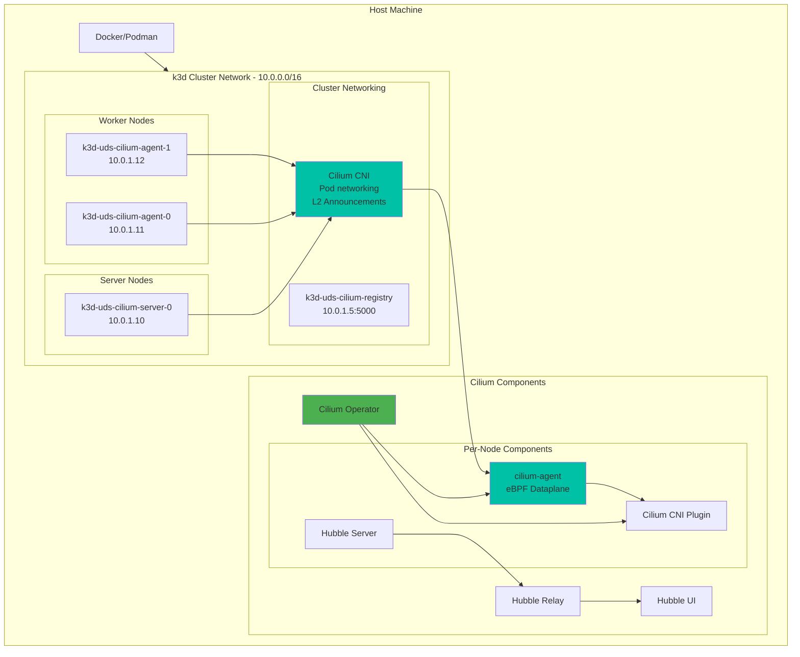
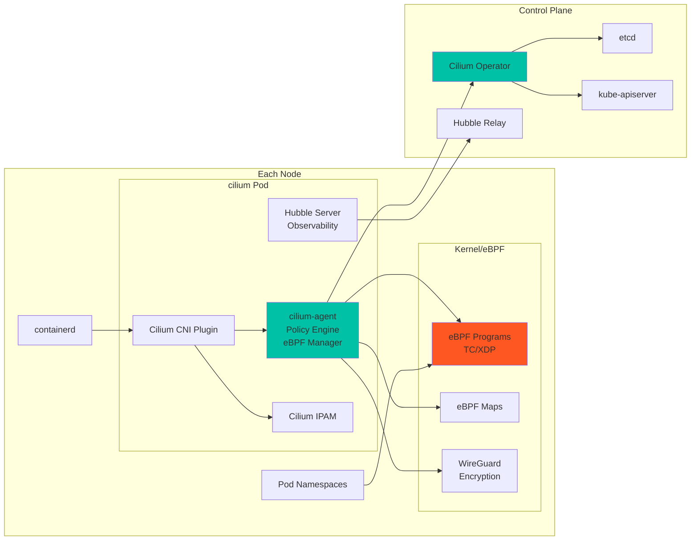

# Cilium CNI Documentation

This document provides detailed information about the Cilium CNI integration in the UDS k3d package.

## Overview

The UDS k3d Cilium package deploys Cilium CNI v1.17.4 using the official Cilium CLI. Cilium provides advanced networking capabilities including eBPF-based dataplane, kube-proxy replacement, L2 announcements for LoadBalancer services, network policies, service mesh integration, and comprehensive observability through Hubble.

## Architecture

### k3d Cluster with Cilium



### Cilium Component Architecture



## Core Components

Based on the [official Cilium architecture](https://docs.cilium.io/en/stable/overview/component-overview/), here's how Cilium integrates with our k3d cluster:

### Cilium Agent (`cilium-agent`)
- **Purpose**: Core component running on each cluster node
- **Key Responsibilities**:
  - Programs eBPF maps and manages eBPF programs
  - Implements kube-proxy replacement functionality
  - Enforces network policies at kernel level
  - Manages pod IP allocation (IPAM)
  - Handles L2 announcements for LoadBalancer services
  - Provides Hubble server for observability

### Cilium Operator
- **Purpose**: Handles cluster-wide operations
- **Key Responsibilities**:
  - IP Address Management (IPAM) coordination
  - Garbage collection of resources
  - CRD management
  - Managing cluster-wide Cilium settings

### CNI Plugin (`cilium-cni`)
- **Purpose**: Kubernetes CNI implementation
- **Key Responsibilities**:
  - Called by kubelet when pods are created/deleted
  - Configures pod networking
  - Sets up eBPF programs for the pod

### Hubble Components
- **Hubble Server**: Embedded in each cilium-agent, provides flow visibility
- **Hubble Relay**: Cluster-wide observability aggregator
- **Hubble UI**: Web interface for visualizing network flows

### L2 Announcements
- **Purpose**: Replaces MetalLB for LoadBalancer services
- **Features**:
  - Responds to ARP queries for service IPs
  - Automatic failover if a node goes down
  - No external dependencies

## CNI Configuration

The package deploys Cilium CNI using the following approach:

1. K3s cluster starts with `--flannel-backend=none` (no default CNI)
2. Cilium is installed immediately after cluster creation using the CLI
3. BPF and cgroup2 filesystems are mounted on all nodes
4. Cilium takes over all networking responsibilities including:
   - Pod networking
   - Service load balancing (kube-proxy replacement)
   - Network policies
   - Ingress controller

## Installation Process

Cilium is installed via the `create-cluster` component in `zarf.yaml`:

1. **Pre-installation**: Mount BPF and cgroup2 filesystems on all nodes
2. **CLI Installation**: Deploy Cilium using `cilium install` with custom values
3. **Post-installation**: Wait for all Cilium components to be ready
4. **L2 IP Pool**: Configure IP address pool for LoadBalancer services

The custom values file (`values/cilium-values.yaml`) configures:
- Kube-proxy replacement mode
- L2 announcements for LoadBalancer services
- Hubble observability with UI
- WireGuard encryption
- SPIRE integration for mTLS
- Cilium Ingress Controller

## Verification

### Check Cilium Installation

```bash
# Check Cilium status
cilium status

# Check Cilium pods
kubectl get pods -n kube-system -l k8s-app=cilium

# Check Cilium operator
kubectl get pods -n kube-system -l name=cilium-operator

# Check Hubble status
hubble status

# View Cilium endpoints
kubectl get ciliumendpoints -A
```

### Verify L2 Announcements

```bash
# Check L2 IP pool
kubectl get ciliumloadbalancerippool

# Create a LoadBalancer service to test
kubectl create deployment nginx --image=nginx
kubectl expose deployment nginx --type=LoadBalancer --port=80

# Check if IP is assigned
kubectl get svc nginx
```

### Access Hubble UI

```bash
# Port-forward Hubble UI
kubectl port-forward -n kube-system svc/hubble-ui 12000:80

# Open in browser
open http://localhost:12000
```

## Network Policies

Cilium provides both standard Kubernetes NetworkPolicies and enhanced CiliumNetworkPolicies:

### Example: L7 HTTP Policy

```yaml
apiVersion: cilium.io/v2
kind: CiliumNetworkPolicy
metadata:
  name: http-policy
spec:
  endpointSelector:
    matchLabels:
      app: webapp
  ingress:
  - fromEndpoints:
    - matchLabels:
        app: frontend
    toPorts:
    - ports:
      - port: "80"
        protocol: TCP
      rules:
        http:
        - method: "GET"
          path: "/api/.*"
```

### Example: DNS Policy

```yaml
apiVersion: cilium.io/v2
kind: CiliumNetworkPolicy
metadata:
  name: dns-policy
spec:
  endpointSelector:
    matchLabels:
      app: webapp
  egress:
  - toEndpoints:
    - matchLabels:
        k8s:io.kubernetes.pod.namespace: kube-system
        k8s-app: kube-dns
    toPorts:
    - ports:
      - port: "53"
        protocol: UDP
  - toFQDNs:
    - matchPattern: "*.example.com"
```

## Troubleshooting

### Cilium Issues

If Cilium pods are not starting:

```bash
# Check Cilium logs
kubectl logs -n kube-system -l k8s-app=cilium

# Check operator logs
kubectl logs -n kube-system -l name=cilium-operator

# Run Cilium connectivity test
cilium connectivity test

# Check eBPF programs
cilium bpf list

# Debug with Hubble
hubble observe --follow
```

### Common Issues

1. **BPF filesystem not mounted**: Ensure the BPF mount commands ran successfully
2. **Kernel version**: Verify kernel supports eBPF (5.10+)
3. **IP Pool conflicts**: Ensure L2 IP pool doesn't overlap with node IPs
4. **Service connectivity**: Check if kube-proxy replacement is working

### L2 Announcement Issues

```bash
# Check L2 announcement policy
kubectl get ciliuml2announcementpolicy

# Verify ARP entries on nodes
docker exec k3d-uds-cilium-agent-0 arp -a

# Check Cilium agent logs for L2 announcements
kubectl logs -n kube-system -l k8s-app=cilium | grep -i l2
```

## Advanced Configuration

### Custom L2 Announcement Policy

```yaml
apiVersion: cilium.io/v2alpha1
kind: CiliumL2AnnouncementPolicy
metadata:
  name: custom-policy
spec:
  serviceSelector:
    matchLabels:
      announce: "true"
  interfaces:
  - eth0
  externalIPs: true
  loadBalancerIPs: true
```

### Enable BGP (Advanced)

While not enabled by default, Cilium supports BGP for advanced routing:

```yaml
apiVersion: cilium.io/v2alpha1
kind: CiliumBGPPeeringPolicy
metadata:
  name: bgp-policy
spec:
  nodeSelector:
    matchLabels:
      bgp: "true"
  virtualRouters:
  - localASN: 65001
    neighbors:
    - peerASN: 65000
      peerAddress: 10.0.0.1/32
```

### Network Performance Tuning

Cilium's eBPF dataplane provides superior performance. Key settings in `values/cilium-values.yaml`:

- `bpf.masquerade: false` - Disable masquerading for better performance
- `socketLB.enabled: true` - Socket-level load balancing
- `kubeProxyReplacement: true` - Full kube-proxy replacement
- `ipv4NativeRoutingCIDR: "10.0.0.0/9"` - Native routing for local traffic

## Integration with UDS Core

Cilium integrates seamlessly with UDS Core components:

1. **Istio Service Mesh**: Cilium can accelerate Istio with eBPF
2. **Network Policies**: Work alongside Istio authorization policies
3. **Observability**: Hubble complements Istio telemetry
4. **Ingress**: Cilium Ingress Controller can work with Istio Gateway

## Resources

- [Cilium Documentation](https://docs.cilium.io/)
- [Cilium eBPF Architecture](https://docs.cilium.io/en/stable/bpf/architecture/)
- [L2 Announcements Guide](https://docs.cilium.io/en/stable/network/l2-announcements/)
- [Hubble Documentation](https://docs.cilium.io/en/stable/overview/intro/#what-is-hubble)
- [Network Policies](https://docs.cilium.io/en/stable/security/policy/)